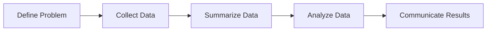

Source: [<font color="#FFBB64">DASW_02_IntroStatistics</font>](https://drive.google.com/file/d/1ITgacIlUwHV9thGs0PszBPoAWNGMqGi0/view?usp=drive_link)
Handbook: [<font color="#FFBB64">Probability and Statistical Interference</font>](https://drive.google.com/file/d/1szBlU2wh_O8HENk9T6_Ojr6MGTHQw6Qy/view?usp=sharing)

#DCFFB7 #FF6868 #FFBB64 #FFEAA7 #AnalisisData
***
# <font color="#DCFFB7">Introduction</font>
## <font color="#FF6868">A. Data Analysis</font>
<p align="justify">Data analysis can be defined as the process of
systematically <mark class="hltr-purple">applying statistical</mark> and or logical
techniques to describe and illustrate, condense and
recap, and <mark class="hltr-purple">evaluate data</mark>. </p>
<p align="justify">Statistics is the science of designing studies or
experiments, collecting data, modeling and analyzing data for the purpose of decision making and <mark class="hltr-purple">scientific discovery</mark> when the available information is both limited and variable.</p>

```
Data Analysis: Science of learning from data collected via a scientific method.
```

## <font color="#FF6868">B. Scientific Writing</font>
<p align="justify">These data could be in the form of quarterly sales figures, percent increase in mechanical properties, contamination levels in water samples, survival rates for patients undergoing medical therapy, census figures, or information that helps determine which brand of car to purchase. In order to <mark class="hltr-purple">communicate the result</mark> from scientific data, it needs to be written in the forms of scientific writing.</p>

```
Scientific writing : Technical form of writing that is designed to communicate scientific information to other scientists.
```


---
# <font color="#DCFFB7">Approach - Process in learning from data</font>

- <font color="#FFEAA7">Formulate research goal</font>: research hypotheses, models
- <font color="#FFEAA7">Design study</font>: sample size, variables, experimental units, sampling mechanism
- <font color="#FFEAA7">Collect data</font>: data management
- <font color="#FFEAA7">Draw inferences</font>: graphs, estimation, hypotheses testing, model assessment
- <font color="#FFEAA7">Make decisions</font>: written conclusions, oral presentations
- <font color="#FFEAA7">Formulate new research goals</font>: new models, new hypotheses

<p align="justify">To infer validly that the results of a study are applicable to a larger group than just the participants in the study, we must carefully <mark class="hltr-purple">define the population</mark> to which inferences are sought and design a study in which the sample has been appropriately selected from the designated population</p>

```
Population: Set of all measurements of interest to the sample collector

Sample: Any subset of measurements selected from the population.
```

## <font color="#FF6868">A. Population, Sample, and Observations</font>
**Source:** [<font color="#FFEAA7">LaTeX Math Symbols</font>](https://kapeli.com/cheat_sheets/LaTeX_Math_Symbols.docset/Contents/Resources/Documents/index)

$\omega$ : units on which we measure data
$\ohm$ : population or collection of all units
$\omega$  $\varepsilon$  $\ohm$  : a single unit out of a population
$\omega_1$, $\omega_2$, $\dots$ , $\omega_n$ : sample

## <font color="#FF6868">B. Variable</font>
<p align="justify">If we have specified the population of interest for a specific research question, we can think of what is of interest about our observations. A particular feature of these observations can be collected in a <mark class="hltr-purple">statistical variable X</mark>.</p>

<p align="justify">Any information we are interested in may be  captured in such a variable. Of course, we can be interested in many different features, each of them collected in a different variable </p> 

$$X_i,i = 1, 2, \dots , p$$

<font color="#FFEAA7"><strong>Formal Definition</strong></font>
$$X : \ohm \rightarrow S$$
$$\omega \rightarrow x$$
<font color="#FFEAA7"><strong>Example</strong></font>
- $S = \{male, female\}$
- Variable $X$ have the value where it refers to the S, or gender.

```
Variable can be qualitative or quantitative.
```

### <font color="#FFBB64">B.1 Qualitative and Quantitative Variables</font>
<p align="justify">Qualitative variables are the variables which take values x that cannot be ordered in a logical or natural way. Example, color of the eye. There is no reason to list blue eyes before brown eyes (or vice versa).</p>

```
Qualitative Variable: Can NOT be ordered in logical or natural way
```

Quantitative variables represent measurable quantities. The values which these variables can take can be ordered in a logical and natural way. Example is number of semesters studied.</p>

```
Quantitative Variable: Can be ordered in logical or natural way
```

### <font color="#FFBB64">B.2 Discrete and Continuous Variable</font>
<p align="justify">Discrete variables are variables which can only take a <mark class="hltr-purple">finite number</mark> of values. Qualitative variables are discrete. But, quantitative variables can also be discrete.</p>

<p align="justify">Variables which can take an infinite number of values are called continuous variables. Example, time it takes to travel to a place. Continuous variables are variables which are <mark class="hltr-purple">measured</mark> rather than counted </p>

<font color="#FFEAA7">Discrete Variables:</font>
- Can only assume specific values that cannot be subdivided.
- Typically counted, resulting in integer values.
- Examples include the number of cats in an animal shelter or the number of people in a household.

<font color="#FFEAA7">Continuous Variables:</font>
- Can take on an infinite number of values within a range.
- Values are measured, not counted.
- Examples include height, weight, and temperature.

### <font color="#FFBB64">B.3 Scale</font>
<font color="#FFEAA7">Nominal Scale</font>
- Nominal data categorizes variables into non-ordered categories or labels.
- Examples include gender, race, and religion.
- There is no inherent order or ranking among the categories.

<font color="#FFEAA7">Ordinal Scale</font>
- Ordinal data categorizes variables into ordered categories or ranks.
- It provides a sense of order, but the differences between the categories are not uniform.
- Examples include Likert scales (e.g., strongly agree, agree, neutral, disagree, strongly disagree) and educational levels (e.g., high school, bachelor's, master's, doctorate).

<font color="#FFEAA7">Continuous Scale</font>
- Continuous data are also known as interval, ratio, or count variables.
- They possess a "true zero" and provide a measure of both magnitude and distance.
- Examples include height, weight, and temperature.

## <font color="#FF6868">C. Data Collection</font>
```
Data: collection of experimental results obtained from observations or materials characterization.
```

Based on <mark class="hltr-purple">the way data collected</mark> from a research, they can be classified into two broad categories:
### <font color="#FFBB64">A. Qualitative Data</font>
<p align="justify">The characteristics or traits for which numerical value can not be assigned. For example, observation of microstructure using electron microscope (SEM/TEM) .</p>


```
Qualitative Data: Used to find out the facts
```


### <font color="#FFBB64">B. Quantitative Data</font>
<p align="justify">The characteristics or traits for which numerical value can be assigned. For example, elemental composition determination using energy dispersive X-ray spectroscopy (EDX).</p>


```
Quantitative Data: Formulate new theory or principles.
```

***
### <font color="#FFBB64">Methods of Data Collection</font>
<p align="justify">Collection of data is very essential as an evidence to what is being formulized. It provides a define direction and definite answer to a research inquiry. The main purpose of data collection is to <mark class="hltr-purple">verify the hypotheses</mark>.</p>
<font color="#FFEAA7">A. Survey</font>
<p align="justify">a survey typically collects data by <mark class="hltr-purple">asking questions</mark> (in person) or providing questionnaires to study participants (as a printout or online).</p>
<font color="#FFEAA7">B. Experiment</font>
<p align="justify">experimental data is obtained in “controlled” settings. This can mean many things, but essentially it is data which is generated by the researcher with <mark class="hltr-purple">full control over variables</mark> of interest.</p>
<font color="#FFEAA7">C. Observational Data</font>
<p align="justify">observational data is data which is <mark class="hltr-purple">collected routinely</mark> without a researcher designing a survey or conducting an experiment. For example, a blood sample is drawn from each patient with a particular acute infection when they 
arrive at a hospital. </p>
<font color="#FFEAA7">D. Primary and Secondary Data</font>
<p align="justify">Primary data is data we collect ourselves, meanwhile secondary data is collected by someone else.</p>

***
## <font color="#FF6868">C. Ethical Consideration</font>
<p align="justify">Any researcher who involves animal or human  sample subjects in his/her research has certain responsibilities towards them. A researcher must:</p>

- <font color="#FFEAA7">Respect subjects</font>: prioritize their dignity, welfare, and right to decline participation.
- <font color="#FFEAA7">Protect privacy</font>: avoid violating privacy or revealing identities.
- Maintain ethical standards: both researchers and supervisors are responsible.
- <font color="#FFEAA7">Seek ethical guidance</font>: consult relevant ethical statements beforehand.
- <font color="#FFEAA7">Anonymize data</font>: don't mention names of subjects or institutions in reports or appendices; use code numbers instead.
***
### <font color="#FFBB64">Good Research Data</font>
- <font color="#FFEAA7">Relevant</font>: addresses the research question directly.
- <font color="#FFEAA7">Accurate</font>: free from measurement errors and factual mistakes.
- <font color="#FFEAA7">Precise</font>: detailed and specific enough for clear interpretation.
- <font color="#FFEAA7">Reliable</font>: consistent and reproducible under similar conditions.
- <font color="#FFEAA7">Valid</font>: measures what it's supposed to measure.
- <font color="#FFEAA7">Objective</font>: collected free from personal bias or influences.
- <font color="#FFEAA7">Complete</font>: gathers enough data to draw proper conclusions.
- <font color="#FFEAA7">Analyzable</font>: easily categorized and subjected to statistical tests.
- <font color="#FFEAA7">Interpretable</font>: clearly presents and explains the collected data.

***
# <font color="#DCFFB7">Flashcards</font>

[[#<font color=" DCFFB7">Introduction</font>|Introduction]]
What is the main purpose of data analysis?::(Answer: To describe, summarize, and evaluate data using statistical and logical techniques.)
What is the science of designing studies and analyzing data for discovery and decision-making?::(Answer: Statistics)
What are some examples of data that can be analyzed?::(Answer: Sales figures, mechanical properties, contamination levels, patient survival rates, census data, brand preferences)
What is the purpose of scientific writing in data analysis?::(Answer: To communicate the results of a study to others)

[[#<font color=" DCFFB7">Approach - Process in learning from data</font>|Approach - Process in learning from data]]
What are the five main steps in the process of learning from data?::(Answer: Define problem, collect data, summarize data, analyze data, communicate results)
What is the first step in formulating a research goal?::(Answer: Specifying the research question or hypothesis)
What does designing a study involve?::(Answer: Determining sample size, variables, experimental units, and sampling method)
What are some ways to draw inferences from data?::(Answer: Using graphs, estimation, hypothesis testing, and model assessment)
What is the connection between defining the population and drawing valid inferences?::(Answer: We must carefully define the population to ensure our study results can be applied to a larger group)

[[#<font color=" FF6868">A. Population, Sample, and Observations</font>|Population, Sample, and Observations]]
Population, Sample, and Observations:
What is the difference between a population and a sample?::(Answer: A population is all the measurements of interest, while a sample is a subset of those measurements)
What is the symbol used to represent a single unit in a population?::(Answer: ω)
What is the symbol used to represent a sample?::(Answer: ω₁, ω₂, ..., ωₙ)
<!--SR:!2024-02-01,3,250-->

[[#<font color=" FF6868">B. Variable</font>|Variable]]
What is a statistical variable?::(Answer: A feature of observations that can be collected and analyzed)
What is an example of a variable in research?::(Answer: Gender, number of semesters studied, time spent traveling)
What is the formal definition of a variable?::(Answer: A function that maps units in a population to a set of values)

[[#<font color=" FFBB64">B.1 Qualitative and Quantitative Variables</font>|Qualitative and Quantitative Variables]]
What is a qualitative variable?::(Answer: A variable with values that cannot be ordered logically, like eye color)
<!--SR:!2024-02-01,3,250-->
What is a quantitative variable?::(Answer: A variable with measurable values that can be ordered logically, like number of semesters)
Can quantitative variables be discrete or continuous? Explain.::(Answer: Yes, discrete quantitative variables have finite values (number of cats), while continuous variables have infinite values within a range (height).)
<!--SR:!2024-02-01,3,250-->

[[#<font color=" FFBB64">B.2 Discrete and Continuous Variable</font>|Discrete and Continuous Variable]]
What is the difference between a discrete and a continuous variable?::(Answer: Discrete variables have specific, countable values, while continuous variables can take an infinite number of values within a range.)

[[#<font color=" FFBB64">B.3 Scale</font>]]
What are the three main types of scales used for variables?::(Answer: Nominal, ordinal, and interval/ratio/count)
What type of scale is used for categories with no inherent order, like gender?::(Answer: Nominal)
What type of scale is used for ordered categories, like Likert scales?::(Answer: Ordinal)
What type of scale is used for variables with true zero and measurable differences, like height?::(Answer: Interval/ratio/count)
<!--SR:!2024-02-01,3,250-->

[[#<font color=" FF6868">C. Data Collection</font>|Data Collection]]
What are the two main categories of data based on how it is collected?::(Answer: Qualitative and quantitative)
<!--SR:!2024-02-01,3,250-->
What is an example of quantitative data?::(Answer: Elemental composition determined by EDX)
What is an example of qualitative data?::(Answer: Observation of microstructure using SEM/TEM)

[[#<font color=" FFBB64">Methods of Data Collection</font>|Methods of Data Collection]]
What are some common methods of data collection?::(Answer: Surveys, experiments, observational data, primary and secondary data)
What is the main purpose of collecting data in research?::(Answer: To verify the research hypothesis)
<!--SR:!2024-02-01,3,250-->
What is the difference between primary and secondary data?::(Answer: Primary data is collected by the researcher, while secondary data is collected by someone else)

[[#<font color=" FF6868">C. Ethical Consideration</font>|Ethical Consideration]]
What are some important ethical considerations for researchers who use human or animal subjects?::(Answer: Respecting subjects, protecting privacy, maintaining ethical standards, anonymizing data)

